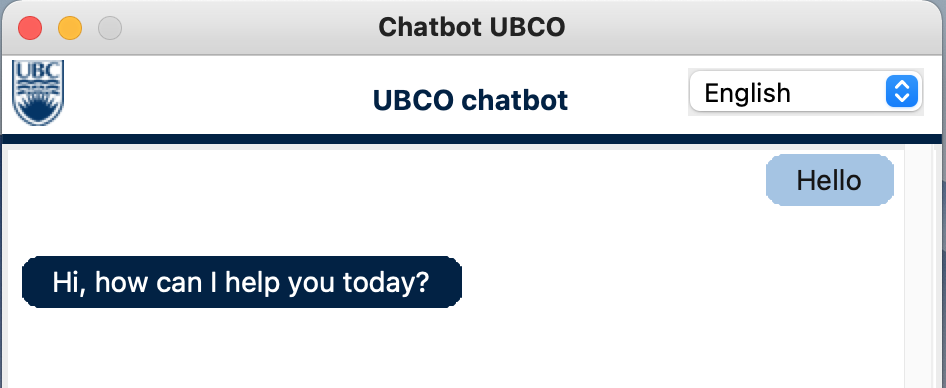
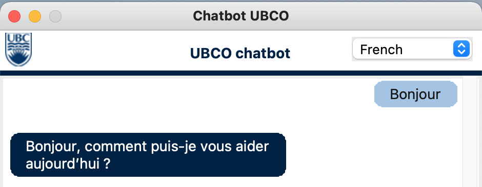
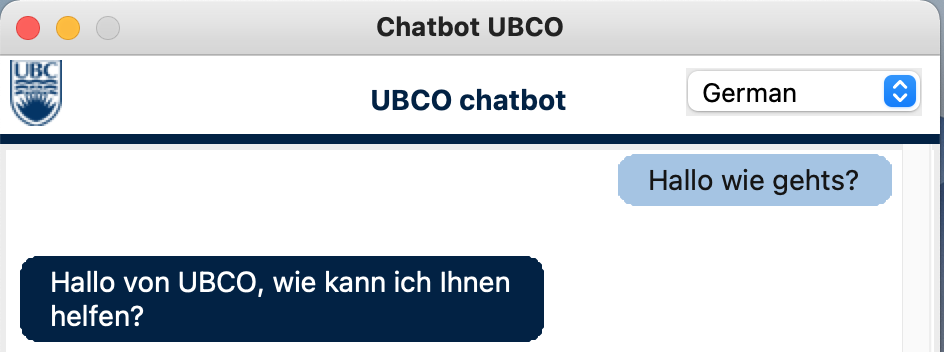
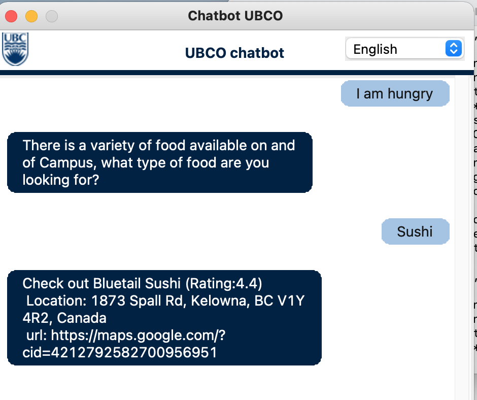
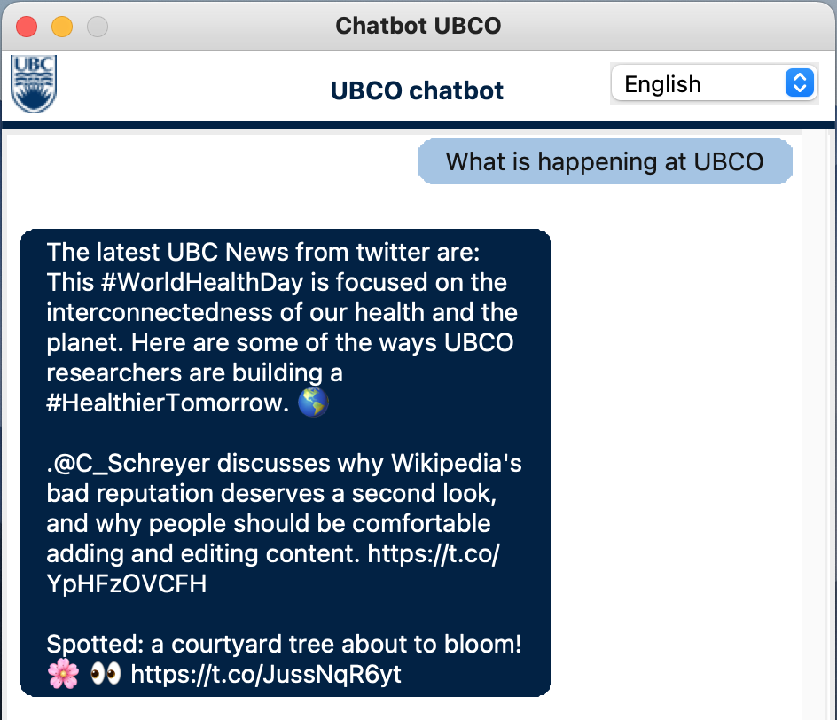

# chat-bot-cosc-310
The purpose of this chatbot is to help students and interested people to navigate around and get information about UBCO, like opening hours locations but also infor on the application process. By this the enables the user to easily get access to the information about UBCO he/she is looking for.

## Installation
1. Ensure you have the latest version of [Python](https://www.python.org/downloads/) installed.

2. Install `pipenv` ([Pipenv Documentation](https://pypi.org/project/pipenv/))
    1. Open the command terminal
    2. Run `pip install pipenv`

3. Download the project dependencies
    1. Open the command terminal in the project root directory
    2. Run `pipenv shell` to start the virtual environment
    3. Run `pipenv update` or `pipenv update --dev` (developers) to download the project's dependencies
    4. Run `pipenv run python -m spacy download en_core_web_sm` to download spacy's dependencies
    
## Running Unit Tests

- To run all tests run `python -m unittest discover -s ./`

- To run a specific test file:
    - Run the test file directly `python <test_file>.py`
    - Or run `python -m unittest <test_file>.<TestClass>`

- To run a specific test
    - Run `python -m unittest <test_file>.<TestClass>.<test_name>`

### Important Note: 
Run all tests from the `tests` directory. 
This ensures the mock files are located correctly by Python.

## Running the Application
Run `python chatbot_run.py` to start the application.

## The list of features

### Named Entity recognition using Spacy
The file `NER_func.py` analyzes the raw user text and identifies named entities in it (For example UBCO and Commons are named entities). We then use this function in `chatbot.py`. If there were named entities in the message the bot will provide the information user requested for a given entity. For example, the bot can provide the information on the opening hours of the Commons.

   **Snippet:**
    
   

### Spellchecker using symspellpy
The file `spellchecker.py` provides the class which splits the conjoined words and corrects minor spelling mistakes. The file accepts raw text and returns the corrected version. Later, this corrected message is used to get the response from the bot. The bot gives more meaningful responses to the sentences which went through spell checking (as opposed to misspelled sentences which did not go through it), because it helps standardize the type of requests the bout usually receives.

   **Snippet with spellchecking disabled:**
    
   

   **Snippet with spellchecking enabled:**

   

### Graphical user interface using tkinter in Python
The file `app_gui.py` creates a graphical interface for the chatbot which opens in a separate window. The graphical interface improves user experience by providing an intuitive way of talking to a bot.

   **Snippet:**

   

### Sockets using Python sockets
Sockets allow the bot to interact with other bots (or itself). The files `socket_client.py` and `socket_server.py` contain the implementation of TCP sockets, using the socket module in Python. These allow our bot to play either the server or the client role when interacting with other bots, that are able to send and receive messages using TCP connections.

   **Snippet:**

   
    
### Share with user if not sure about the input
The chatbot uses a threshold on the intents prediction and under a certain threshold returns, that he did no understand the user probably.

   **Snippet:**

   
    

## Individual Assignment

### Translation to make the Bot multilingual
The chatbot uses the microsoft translator api to communicate in french and german besides english, by translating to english once an input is received adn back when returning his response. New languages can be easily added by expanding the options and adjusting the chatbot slightly.

   **Snippet:**

   
   
   

### Food Recommendations using Google Maps and Google Places
The chatbot is able to recommend food places around Campus based on your entered preferences. For this the bot first extracts the coordinates of UBCO using Google Maps API (Can be easily adapted for other institutions with different locations). In the next step the bot asks you for your prefrences and uses these to search places around you, calling the Google places API with this keyword. Finally it extracts randomly a place from the returned list and gets the details for this place using again the places API and returns them.

   **Snippet:**

   

### UBCO News, using the Twitter API
The chatbot is able to share the latest tweets of UBCO, using the twitter API. It connects to the twitter API using tweepy and extracts the content of the last 3 tweets from the official UBCO twitter channel. (This is easily expandable for various other accounts e.g. the one from UBCO heat).

   **Snippet:**

   
